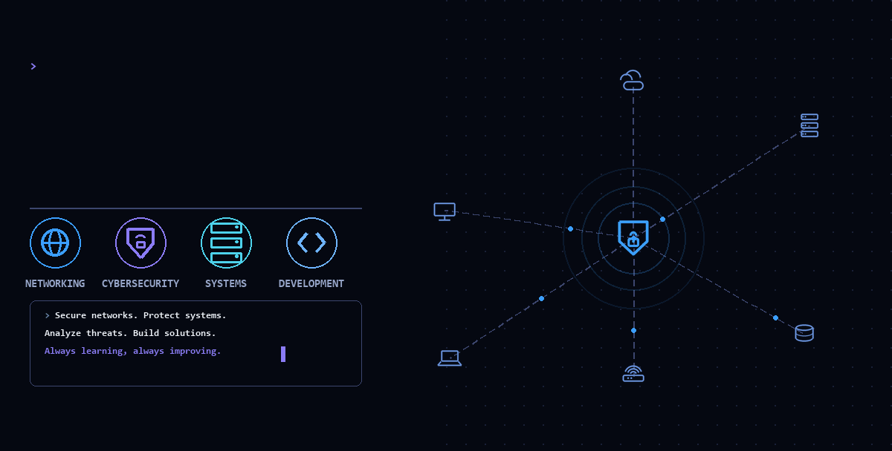

<!-- ====================================================== -->
<!--                      HERO BANNER                       -->
<!-- ====================================================== -->

<p align="center">
  
</p>

<br>

<!-- ====================================================== -->
<!--                       INTRO                            -->
<!-- ====================================================== -->

<h1 align="center">HELLO WORLD, I'M <span style="color:#58a6ff;">LE CONG BAO</span></h1>

<p align="center">
  <strong>Computer Networks & Data Communications Student</strong>
</p>

<p align="center">
  🌐 Networking &nbsp;&nbsp; 🛡️ Cybersecurity &nbsp;&nbsp; 💻 Technology
</p>

<br>

<p align="center">
  <i>
    Interested in computer networks, cybersecurity, and exploring how technology
    can be used to build secure and reliable systems.
  </i>
</p>

---

<!-- ====================================================== -->
<!--                      ABOUT ME                          -->
<!-- ====================================================== -->

## 📌 About Me

- 🎓 Student majoring in **Computer Networks & Data Communications**
- 🌐 Passionate about **Computer Networking** and network technologies
- 🛡️ Interested in **Cybersecurity** and **Network Security**
- 💻 Enjoy learning programming and developing technical skills
- 🐧 Interested in **Linux** and system environments
- 🔧 Enjoy working with networking and development tools
- 📚 Always exploring new technologies and strengthening my fundamentals
- 🚀 Focused on continuous learning and practical improvement

---

<!-- ====================================================== -->
<!--                 AREAS OF INTEREST                      -->
<!-- ====================================================== -->

## 🎯 Areas of Interest

| Area | Interests |
|:---|:---|
| 🌐 **Computer Networking** | Network Infrastructure, Routing, Switching, IPv4/IPv6 |
| 🛡️ **Cybersecurity** | Network Security, Threat Detection, Security Technologies |
| 💻 **Programming** | Python, Java, C# |
| 🐧 **Systems** | Linux and system environments |
| 🤖 **Technology** | Machine Learning and emerging technologies |

---

<!-- ====================================================== -->
<!--                    TECH STACK                          -->
<!-- ====================================================== -->

## 🛠️ Tech Stack & Tools

### 💻 Programming

<p>
  
</p>

### 🌐 Networking & Systems

<p>
  
</p>

### 🔧 Development Tools

<p>
  
</p>

### 🌐 Networking Tools

```text
Cisco Packet Tracer
Mininet
Linux Networking
